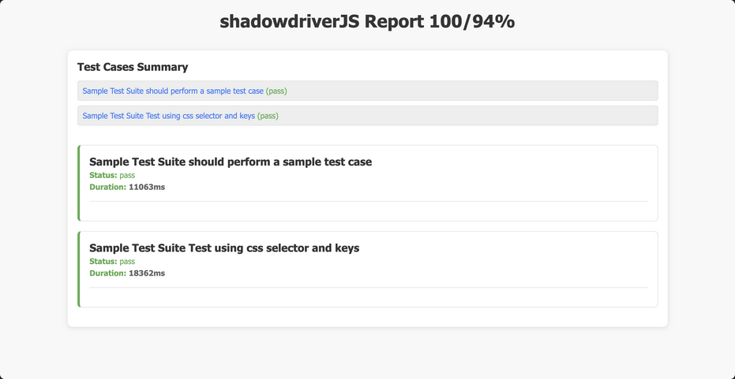

# ShadowDriverJS Report Hook Overview

### Overview of the `generate_report` Hook in ShadowDriverJS

The `generate_report` hook in ShadowDriverJS allows you to create an HTML report summarizing your test results. This function can be customized to save the report in your desired directory.

#### Step-by-Step Guide to Creating a Custom Report

1. **Define the `generate_report` Hook**:
   You can define the `generate_report` hook to generate and save the HTML report using any method you prefer. Here is an example of how you might implement this:

    ```javascript
    
    //Generate shadowdriverjs HTML report hook
    generate_report: () => {
        generate_HTML('./');
    }
  
    ```

2. **Serve the Report**:
   Once you have created the report, you can serve it by running the appropriate command in your terminal or by double-clicking on `./report.html`.

#### Serving the Report

- **Mac/Linux**: Use the `open` command to open the HTML file.
  ```bash
  open ./report.html
  ```

- **Windows**: Use the `start` command to open the HTML file.
  ```cmd
  start report.html
  ```

### Sample Report

Below is an example of a generated HTML report using the `generate_report` hook. This example demonstrates how you can customize the report content and structure.




### Notes

- The `generate_report` function will generate an HTML file named `report.html` in the current directory.
- You can customize the content of the report by modifying the `reportContent` variable within the `generate_report` function.

This setup allows you to easily create and serve a custom test report for your ShadowDriverJS tests.